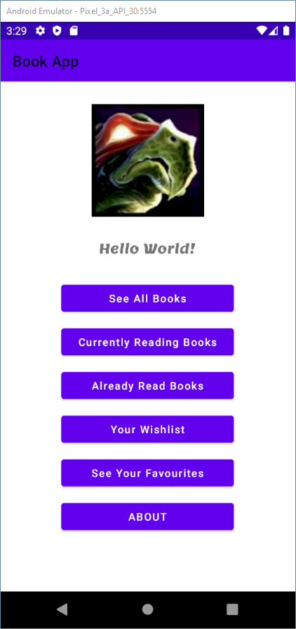
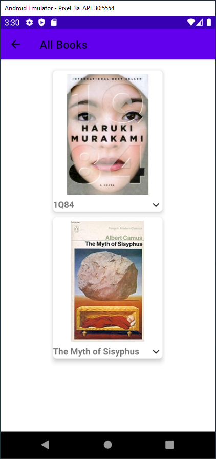
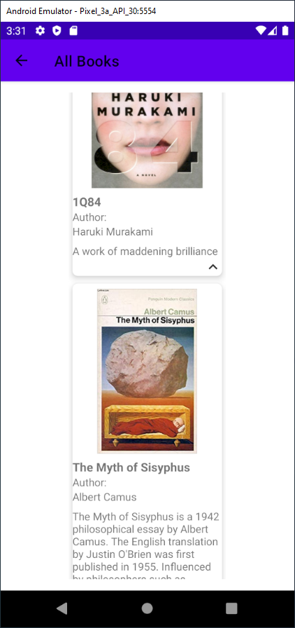
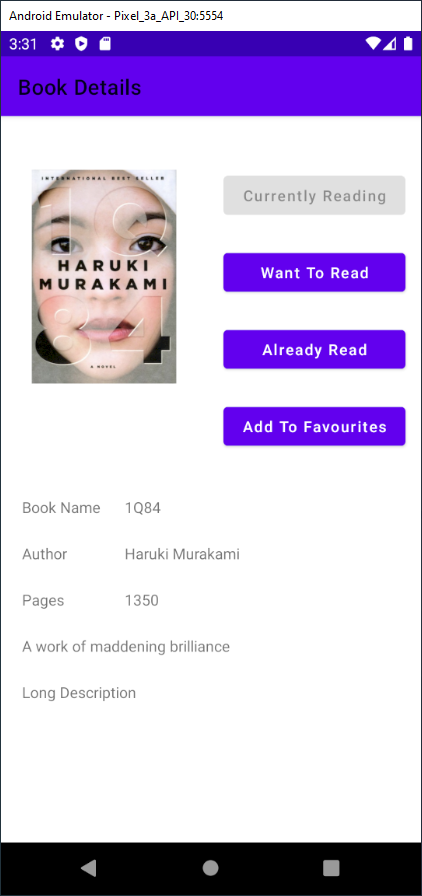
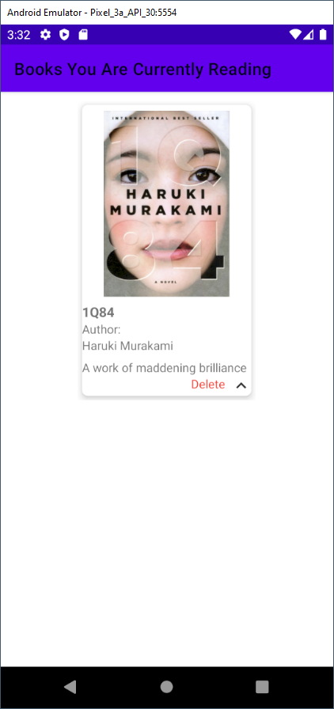
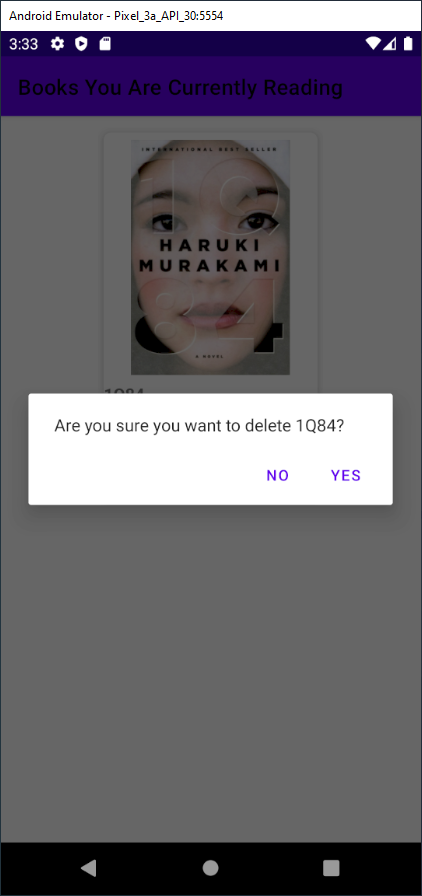

# Book Library App

Following this youtube guide:

- Part 1: https://www.youtube.com/watch?v=fis26HvvDII&ab_channel=freeCodeCamp.org
- Part 2: https://www.youtube.com/watch?v=RcSHAkpwXAQ&t=0s&ab_channel=freeCodeCamp.org

# App Images

## Main Screen (Menu)

## All Books

## Book Details

## Currently Reading Books

